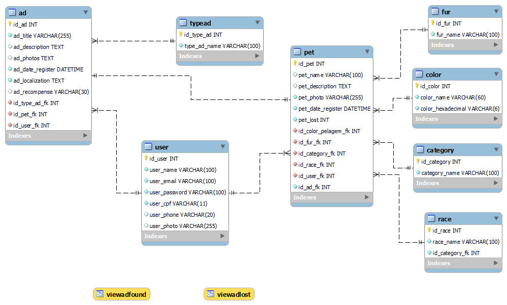
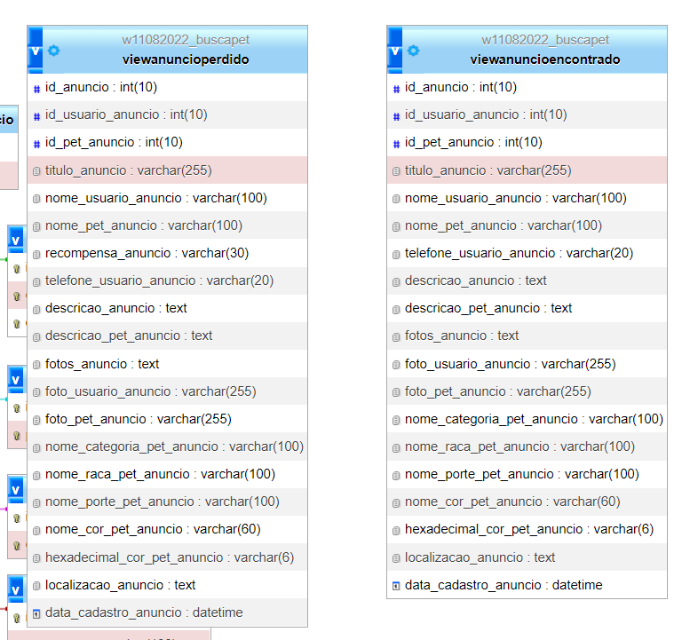

# hands-on-motog
Repositório do time Moto G para o projeto do Hands On
 
 

# Banco de dados - Busca PET
### Baixe: [w11082022_buscapet.sql](./db/w11082022_buscapet.sql)
 

### Relações entre as tabelas:

---
### Views

### Baixe: [w11082022_buscapet.sql](./db/w11082022_buscapet.sql)
---
###

# Back-end
Para rodar o projeto buscapet-api, necessita-se ter instalado:
- Node
- typescript
- nodemon

Os comandos a serem executados no Back consistem em:
- npm install
- npm run dev
- http://localhost:5000/

# Front-end
Para executar o projeto no front-end, precisa ter instalado:
- Angular

Os comandos a serem executados no Front consistem em:
- npm install  
- npm start

# Banco de dados
para executar o script de banco de dados, precisa ter instalado:
- SQL/ MySQL
